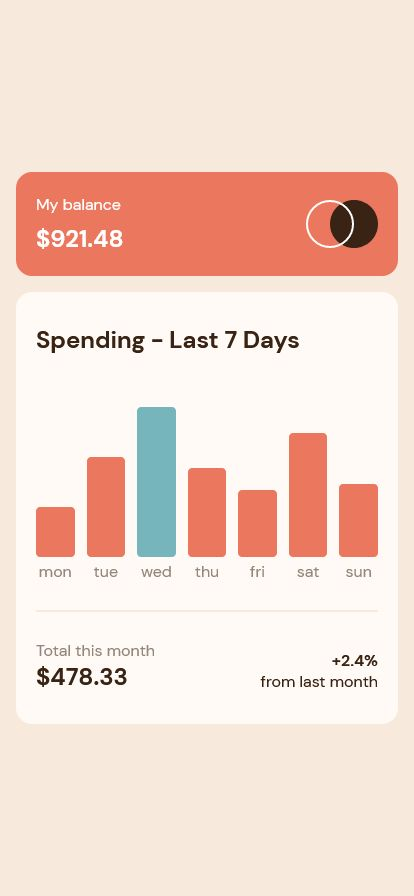

# Frontend Mentor - Expenses chart component solution

This is my solution to the [Expenses chart component challenge on Frontend Mentor](https://www.frontendmentor.io/challenges/expenses-chart-component-e7yJBUdjwt).

## Table of contents

- [Overview](#overview)
  - [The challenge](#the-challenge)
  - [Screenshot](#screenshot)
  - [Links](#links)
- [My process](#my-process)
  - [Built with](#built-with)
  - [What I learned](#what-i-learned)
  - [Continued development](#continued-development)
  - [Useful resources](#useful-resources)
- [Author](#author)
- [Acknowledgments](#acknowledgments)

## Overview

### The challenge

This is my attempt at the Expenses chart component solution. This challenge was very fun in testing my knowledge of how to not only dynamically load data to populate a bar chart, but also how to style the chart based on the data provided.

### Screenshot

Desktop

Mobile

### Links

- Solution URL: [Add solution URL here](https://your-solution-url.com)
- Live Site URL: [Add live site URL here](https://your-live-site-url.com)

## My process

1. I first worked on the markup and some base/reset styling, before working through the styling of each section.
2. I refactored my CSS by way of utility classes.
3. I then worked on dynamically loading the bar chart data in Javascript, as well as dynamically styling the height of the bars.
4. I then worked on tweaking the layout (spacing, sizing) for smaller viewport sizes in accordance with the design images.

### Built with

- Semantic HTML5 markup
- CSS custom properties
- Flexbox
- CSS Grid

### What I learned

I learned about dynamic styling, particularly when dealing with an array of data instead of a singular piece of data.

## Author

- Github - [sheronimo](https://github.com/sheronimo)
- Frontend Mentor - [@sheronimo](https://www.frontendmentor.io/profile/sheronimo)
